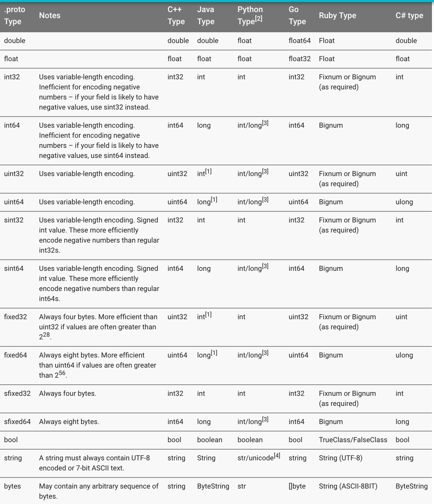
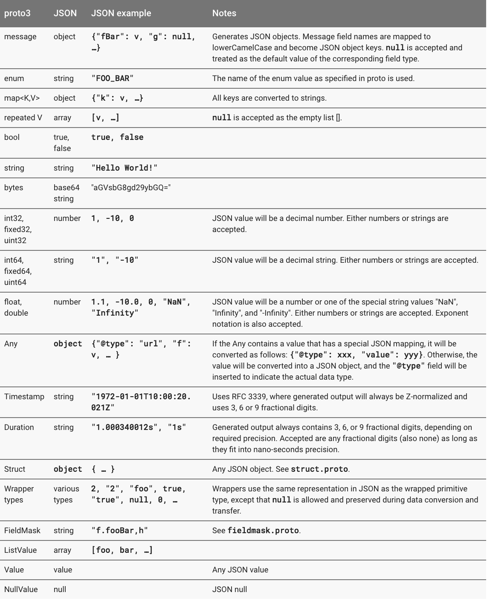

Here's the .proto file you use to define the message type.

```
syntax = "proto3";

message SearchRequest {
  string query = 1;
  int32 page_number = 2;
  int32 result_per_page = 3;
}

```

Scalar Value Types



##Default Values

When a message is parsed, if the encoded message does not contain a particular singular element, the corresponding field in the parsed object is set to the default value for that field. These defaults are type-specific:

- For strings, the default value is the empty string.
- For bytes, the default value is empty bytes.
- For bools, the default value is false.
- For numeric types, the default value is zero.
- For enums, the default value is the first defined enum value, which must be 0.
- For message fields, the default value is null.

##Enumerations

In the following example we've added an enum called Corpus with all the possible values, and a field of type Corpus:

```
message SearchRequest {
  string query = 1;
  int32 page_number = 2;
  int32 result_per_page = 3;
  enum Corpus {
    UNIVERSAL = 0;
    WEB = 1;
    IMAGES = 2;
    LOCAL = 3;
    NEWS = 4;
    PRODUCTS = 5;
    VIDEO = 6;
  }
  Corpus corpus = 4;
}

```

You can define aliases by assigning the same value to different enum constants. To do this you need to set the allow_alias option to true, otherwise the protocol compiler will generate an error message when aliases are found.

```
enum EnumAllowingAlias {
  option allow_alias = true;
  UNKNOWN = 0;
  STARTED = 1;
  RUNNING = 1;
}
enum EnumNotAllowingAlias {
  UNKNOWN = 0;
  STARTED = 1;
  // RUNNING = 1;  // Uncommenting this line will cause a compile error inside Google and a warning message outside.
}

```
##Using Other Message Types

You can use other message types as field types. For example, let's say you wanted to include Result messages in each SearchResponse message – to do this, you can define a Result message type in the same .proto and then specify a field of type Result in SearchResponse:

```

message SearchResponse {
  repeated Result results = 1;
}

message Result {
  string url = 1;
  string title = 2;
  repeated string snippets = 3;
}

```

##Importing Definitions

You can use definitions from other .proto files by importing them. To import another .proto's definitions, you add an import statement to the top of your file:

```
import "myproject/other_protos.proto";

```

now you can put a dummy .proto file in the old location to forward all the imports to the new location using the import public notion. import public dependencies can be transitively relied upon by anyone importing the proto containing the import public statement. For example:

```
// new.proto
// All definitions are moved here

```

```
// old.proto
// This is the proto that all clients are importing.
import public "new.proto";
import "other.proto";

```

```
// client.proto
import "old.proto";
// You use definitions from old.proto and new.proto, but not other.proto

```


##Nested Types

You can define and use message types inside other message types, as in the following example – here the Result message is defined inside the SearchResponse message:

```
message SearchResponse {
  message Result {
    string url = 1;
    string title = 2;
    repeated string snippets = 3;
  }
  repeated Result results = 1;
}

```
If you want to reuse this message type outside its parent message type, you refer to it as Parent.Type:

```
message SomeOtherMessage {
  SearchResponse.Result result = 1;
}

```

You can nest messages as deeply as you like:

```
message Outer {                  // Level 0
  message MiddleAA {  // Level 1
    message Inner {   // Level 2
      int64 ival = 1;
      bool  booly = 2;
    }
  }
  message MiddleBB {  // Level 1
    message Inner {   // Level 2
      int32 ival = 1;
      bool  booly = 2;
    }
  }
}

```

##Updating A Message Type

you'd like the message format to have an extra field . Just remember the following rules:

- Don't change the numeric tags for any existing fields.
- If you add new fields, any messages serialized by code using your "old" message format can still be parsed by your new generated code. You should keep in mind the default values for these elements so that new code can properly interact with messages generated by old code. Similarly, messages created by your new code can be parsed by your old code: old binaries simply ignore the new field when parsing. Note that unknown fields are discarded when the message is deserialized, so if the message is passed on to new code, the new fields will not still be available (this is different behaviour to proto2, where unknown fields are serialized along with the message).
- Fields can be removed, as long as the tag number is not used again in your updated message type. You may want to rename the field instead, perhaps adding the prefix "OBSOLETE_", or make the tag reserved, so that future users of your .proto can't accidentally reuse the number.
- int32, uint32, int64, uint64, and bool are all compatible – this means you can change a field from one of these types to another without breaking forwards- or backwards-compatibility. If a number is parsed from the wire which doesn't fit in the corresponding type, you will get the same effect as if you had cast the number to that type in C++ (e.g. if a 64-bit number is read as an int32, it will be truncated to 32 bits).
- sint32 and sint64 are compatible with each other but are not compatible with the other integer types.
- string and bytes are compatible as long as the bytes are valid UTF-8.
- Embedded messages are compatible with bytes if the bytes contain an encoded version of the message.
- fixed32 is compatible with sfixed32, and fixed64 with sfixed64.
- enum is compatible with int32, uint32, int64, and uint64 in terms of wire format (note that values will be truncated if they don't fit). However be aware that client code may treat them differently when the message is deserialized: for example, unrecognized proto3 enum types will be preserved in the message, but how this is represented when the message is deserialized is language-dependent. Int fields always just preserve their value.

##Any
The Any message type lets you use messages as embedded types without having their .proto definition.
To use the Any type, you need to import google/protobuf/any.proto.

```
import "google/protobuf/any.proto";
message ErrorStatus {
  string message = 1;
  repeated Any details = 2;
}

```

The default type URL for a given message type is type.googleapis.com/packagename.messagename.

Different language implementations will support runtime library helpers to pack and unpack Any values in a typesafe manner – for example, in Java, the Any type will have special pack() and unpack() accessors, while in C++ there are PackFrom() and PackTo() methods:

```
// Storing an arbitrary message type in Any.
NetworkErrorDetails details = ...;
ErrorStatus status;
status.add_details()->PackFrom(details);

// Reading an arbitrary message from Any.
ErrorStatus status = ...;
for (const Any& detail : status.details()) {
  if (detail.IsType<NetworkErrorDetails>()) {
    NetworkErrorDetails network_error;
    detail.UnpackTo(&network_error);
    ... processing network_error ...
  }
}

```
##Oneof

To define a oneof in your .proto you use the oneof keyword followed by your oneof name, in this case test_oneof

```
message SampleMessage {
  oneof test_oneof {
    string name = 4;
    SubMessage sub_message = 9;
  }
}

```

You then add your oneof fields to the oneof definition. You can add fields of any type, but cannot use repeated fields.

###Oneof Features

- Setting a oneof field will automatically clear all other members of the oneof. So if you set several oneof fields, only the last field you set will still have a value.

```
SampleMessage message;
message.set_name("name");
CHECK(message.has_name());
message.mutable_sub_message();   // Will clear name field.
CHECK(!message.has_name());

```

- If the parser encounters multiple members of the same oneof on the wire, only the last member seen is used in the parsed message.
- A oneof cannot be repeated.
- Reflection APIs work for oneof fields.
- If you're using C++, make sure your code doesn't cause memory crashes. The following sample code will crash because sub_message was already deleted by calling the set_name() method.


```
SampleMessage message;
SubMessage* sub_message = message.mutable_sub_message();
message.set_name("name");      // Will delete sub_message
sub_message->set_...            // Crashes here

```

- Again in C++, if you Swap() two messages with oneofs, each message will end up with the other’s oneof case: in the example below, msg1 will have a sub_message and msg2 will have a name.

```
SampleMessage msg1;
msg1.set_name("name");
SampleMessage msg2;
msg2.mutable_sub_message();
msg1.swap(&msg2);
CHECK(msg1.has_sub_message());
CHECK(msg2.has_name());

```

##Backwards-compatibility issues

Be careful when adding or removing oneof fields. If checking the value of a oneof returns None/NOT_SET, it could mean that the oneof has not been set or it has been set to a field in a different version of the oneof. There is no way to tell the difference, since there's no way to know if an unknown field on the wire is a member of the oneof

###Tag Reuse Issues

- Move fields into or out of a oneof: You may lose some of your information (some fields will be cleared) after the message is serialized and parsed.
- Delete a oneof field and add it back: This may clear your currently set oneof field after the message is serialized and parsed.
- Split or merge oneof: This has similar issues to moving regular fields.

##Maps

```
map<key_type, value_type> map_field = N;

```

where the key_type can be any integral or string type (so, any scalar type except for floating point types and bytes). The value_type can be any type.

So, for example, if you wanted to create a map of projects where each Project message is associated with a string key, you could define it like this:

```
map<string, Project> projects = 3;

```

Map fields cannot be repeated. Also note that wire format ordering and map iteration ordering of map values is undefined, so you cannot rely on your map items being in a particular order.

The generated map API is currently available for all proto3 supported languages. You can find out more about the map API for your chosen language in the relevant API reference.

##Backwards compatibility

The map syntax is equivalent to the following on the wire, so protocol buffers implementations that do not support maps can still handle your data:

```
message MapFieldEntry {
  key_type key = 1;
  value_type value = 2;
}

repeated MapFieldEntry map_field = N;

```

##Packages

You can add an optional package specifier to a .proto file to prevent name clashes between protocol message types.

```
package foo.bar;
message Open { ... }

```

You can then use the package specifier when defining fields of your message type:

```
message Foo {
  ...
  foo.bar.Open open = 1;
  ...
}

```

- In C++ the generated classes are wrapped inside a C++ namespace. For example, Open would be in the namespace foo::bar.
- In Java, the package is used as the Java package, unless you explicitly provide an option java_package in your .proto file.
- In Python, the package directive is ignored, since Python modules are organized according to their location in the file system.
- In Go, the package is used as the Go package name, unless you explicitly provide an option go_package in your .proto file.
- In Ruby, the generated classes are wrapped inside nested Ruby namespaces, converted to the required Ruby capitalization style (first letter capitalized; if the first character is not a letter, PB_ is prepended). For example, Open would be in the namespace Foo::Bar.
- In JavaNano the package is used as the Java package, unless you explicitly provide an option java_package in your .proto file.

##Packages and Name Resolution

Type name resolution in the protocol buffer language works like C++: first the innermost scope is searched, then the next-innermost, and so on, with each package considered to be "inner" to its parent package. A leading '.' (for example, .foo.bar.Baz) means to start from the outermost scope instead.

The protocol buffer compiler resolves all type names by parsing the imported .proto files. The code generator for each language knows how to refer to each type in that language, even if it has different scoping rules.

##Defining Services

If you want to use your message types with an RPC (Remote Procedure Call) system, you can define an RPC service interface in a .proto file and the protocol buffer compiler will generate service interface code and stubs in your chosen language. So, for example, if you want to define an RPC service with a method that takes your SearchRequest and returns a SearchResponse, you can define it in your .proto file as follows:

```
service SearchService {
  rpc Search (SearchRequest) returns (SearchResponse);
}

```

There are also a number of ongoing third-party projects to develop RPC implementations for Protocol Buffers. For a list of links to projects we know about, see the [third-party add-ons wiki page](https://github.com/google/protobuf/wiki/Third-Party-Add-ons).

##JSON Mapping

Proto3 supports a canonical encoding in JSON, making it easier to share data between systems. The encoding is described on a type-by-type basis in the table below.



##Options

Here are a few of the most commonly used options:

- java_package (file option): The package you want to use for your generated Java classes. If no explicit java_package option is given in the .proto file, then by default the proto package (specified using the "package" keyword in the .proto file) will be used. However, proto packages generally do not make good Java packages since proto packages are not expected to start with reverse domain names. If not generating Java code, this option has no effect.

```
option java_package = "com.example.foo";
```

- java_outer_classname (file option): The class name for the outermost Java class (and hence the file name) you want to generate. If no explicit java_outer_classname is specified in the .proto file, the class name will be constructed by converting the .proto file name to camel-case (so foo_bar.proto becomes FooBar.java). If not generating Java code, this option has no effect.

```
option java_outer_classname = "Ponycopter";

```

- optimize_for (file option): Can be set to SPEED, CODE_SIZE, or LITE_RUNTIME. This affects the C++ and Java code generators (and possibly third-party generators) in the following ways:
- SPEED (default): The protocol buffer compiler will generate code for serializing, parsing, and performing other common operations on your message types. This code is extremely highly optimized.
- CODE_SIZE: The protocol buffer compiler will generate minimal classes and will rely on shared, reflection-based code to implement serialialization, parsing, and various other operations. The generated code will thus be much smaller than with SPEED, but operations will be slower. Classes will still implement exactly the same public API as they do in SPEED mode. This mode is most useful in apps that contain a very large number .proto files and do not need all of them to be blindingly fast.
- LITE_RUNTIME: The protocol buffer compiler will generate classes that depend only on the "lite" runtime library (libprotobuf-lite instead of libprotobuf). The lite runtime is much smaller than the full library (around an order of magnitude smaller) but omits certain features like descriptors and reflection. This is particularly useful for apps running on constrained platforms like mobile phones. The compiler will still generate fast implementations of all methods as it does in SPEED mode. Generated classes will only implement the MessageLite interface in each language, which provides only a subset of the methods of the full Message interface.

```
option optimize_for = CODE_SIZE;
```

- cc_enable_arenas (file option): Enables arena allocation for C++ generated code.
- objc_class_prefix (file option): Sets the Objective-C class prefix which is prepended to all Objective-C generated classes and enums from this .proto. There is no default. You should use prefixes that are between 3-5 uppercase characters as recommended by Apple. Note that all 2 letter prefixes are reserved by Apple.
- packed (field option): If set to true on a repeated field of a basic numeric type, a more compact encoding is used. There is no downside to using this option. However, note that prior to version 2.3.0, parsers that received packed data when not expected would ignore it. Therefore, it was not possible to change an existing field to packed format without breaking wire compatibility. In 2.3.0 and later, this change is safe, as parsers for packable fields will always accept both formats, but be careful if you have to deal with old programs using old protobuf versions.

```
repeated int32 samples = 4 [packed=true];
```
- deprecated (field option): If set to true, indicates that the field is deprecated and should not be used by new code. In most languages this has no actual effect. In Java, this becomes a @Deprecated annotation. In the future, other language-specific code generators may generate deprecation annotations on the field's accessors, which will in turn cause a warning to be emitted when compiling code which attempts to use the field. If the field is not used by anyone and you want to prevent new users from using it, consider replacing the field declaration with a reserved statement.

```
int32 old_field = 6 [deprecated=true];

```

##Custom Options

Protocol Buffers also allows you to define and use your own options. This is an advanced feature which most people don't need. If you do think you need to create your own options, see the Proto2 Language Guide for details. Note that creating custom options uses extensions, which are permitted only for custom options in proto3.

##Generating Your Classes


To generate the Java, Python, C++, Go, Ruby, JavaNano, Objective-C, or C# code you need to work with the message types defined in a .proto file, you need to run the protocol buffer compiler protoc on the .proto. If you haven't installed the compiler, [download the package](https://developers.google.com/protocol-buffers/docs/downloads.html) and follow the instructions in the README. For Go, you also need to install a special code generator plugin for the compiler: you can find this and installation instructions in the golang/protobuf repository on GitHub.

The Protocol Compiler is invoked as follows:

```
protoc --proto_path=IMPORT_PATH --cpp_out=DST_DIR --java_out=DST_DIR   --python_out=DST_DIR --go_out=DST_DIR --ruby_out=DST_DIR --  javanano_out=DST_DIR --objc_out=DST_DIR --csharp_out=DST_DIR path/to/file.proto

```

- IMPORT_PATH specifies a directory in which to look for .proto files when resolving import directives. If omitted, the current directory is used. Multiple import directories can be specified by passing the --proto_path option multiple times; they will be searched in order. -I=IMPORT_PATH can be used as a short form of --proto_path.
- You can provide one or more output directives:
- --cpp_out generates C++ code in DST_DIR. See the C++ generated code reference for more.
- --java_out generates Java code in DST_DIR. See the Java generated code reference for more.
- --python_out generates Python code in DST_DIR. See the Python generated code reference for more.
- --go_out generates Go code in DST_DIR. Go generated code reference is coming soon!
- --ruby_out generates Ruby code in DST_DIR. Ruby generated code reference is coming soon!
- --javanano_out generates JavaNano code in DST_DIR. The JavaNano code generator has a number of options you can use to customize the generator output: you can find out more about these in the generator README. JavaNano generated code reference is coming soon!
- --objc_out generates Objective-C code in DST_DIR. Objective-C generated code reference is coming soon!
- --csharp_out generates C# code in DST_DIR. C# generated code reference is coming soon!
As an extra convenience, if the DST_DIR ends in .zip or .jar, the compiler will write the output to a single ZIP-format archive file with the given name. .jar outputs will also be given a manifest file as required by the Java JAR specification. Note that if the output archive already exists, it will be overwritten; the compiler is not smart enough to add files to an existing archive.
- You must provide one or more .proto files as input. Multiple .proto files can be specified at once. Although the files are named relative to the current directory, each file must reside in one of the IMPORT_PATHs so that the compiler can determine its canonical name.


